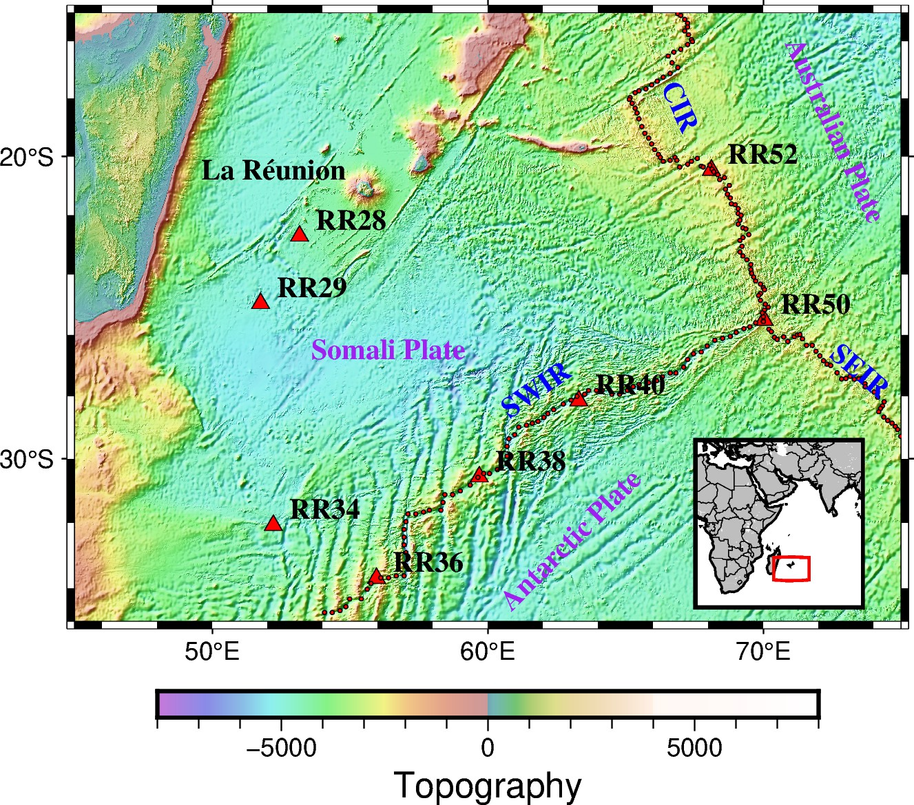

# Bathymetry Map Generator README
<div align="center">
    
</div>

## Description
This Python script uses `pygmt` and `obspy` to generate a detailed map focused on the RHUM-RUM expriment. The map displays bathymetry, topography, ocean ridge points, station locations from a specific network (YV), and various labels including tectonic plate names.

## Prerequisites

1. **Python Environment**: Ensure you have Python 3.x installed.
   
2. **Dependencies**:
    - `pygmt`
    - `numpy`
    - `obspy`
    
   You can activate the conda environment by:
   ```
   conda activate env pygmt
   ```

## Usage

1. Clone the repository:

   ```bash
   git clone <git@github.com:MohammadAmin-Aminian/Map.git>
   cd <repository_name>
   ```

2. Execute the Python script:

3. Upon successful execution, an output map image named `MAP_RHUM1.jpg` will be generated in the current directory.

## Features

- **Topography Visualization**: Uses relief data (`@earth_relief_30s` by default) to visualize topographical details.
  
- **Station Data**: Fetches station data from the RESIF client and plots their locations on the map. The stations covered are `RR28,RR29,RR34,RR36,RR38,RR40,RR50,RR52` from the network `YV`.
  
- **Ocean Ridge Points**: Loads and displays ocean ridge data points.
  
- **Labels**: Adds labels for various locations, ridges, and tectonic plates. For example, the locations include "La Réunion" and ridges like "CIR", "SWIR", and "SEIR".

## Customization

1. **Station Data**: If you want to visualize a different set of stations or a different network, modify the `net` and `sta` variables.
   
2. **Topography**: The script provides comments to switch between various resolutions of topography relief data. Uncomment the desired relief data variable and comment out the others before running the script.
  
3. **Region**: Adjust the `minlon`, `maxlon`, `minlat`, and `maxlat` variables to focus on a different map region.

## Author

- Mohammad Amin Aminian


