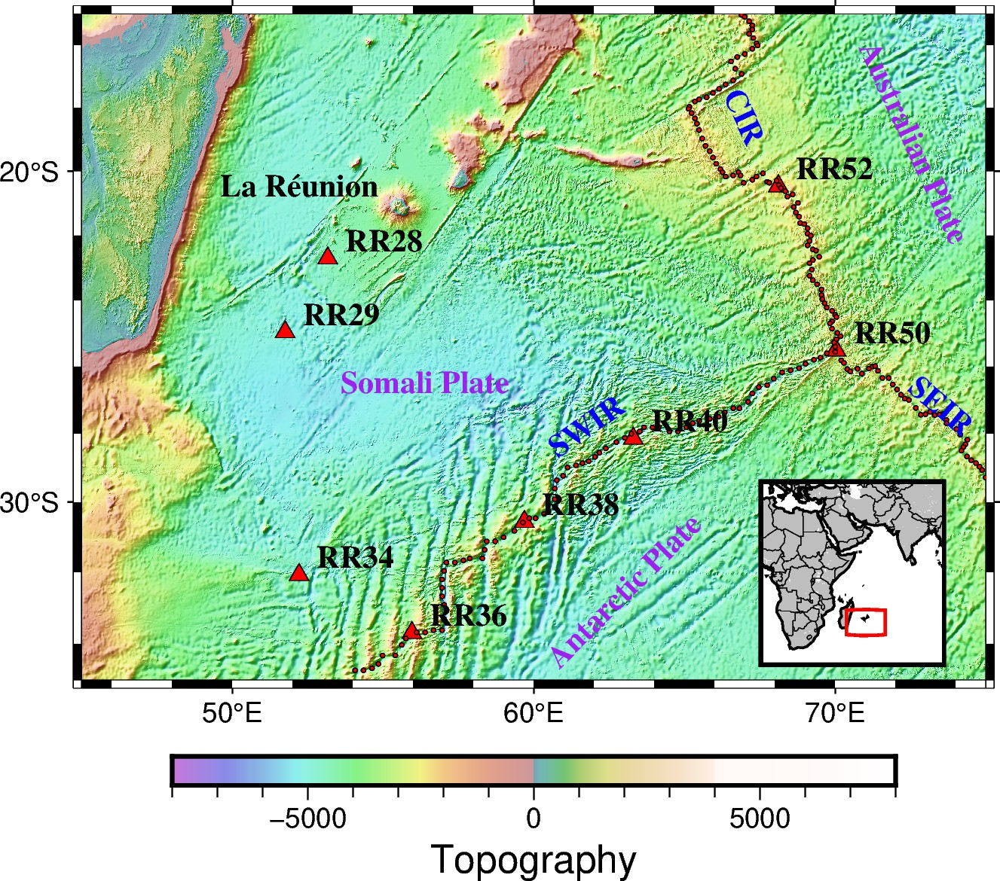

# RHUM-RUM Geospatial Mapper

**Reproducible bathymetry, OBS-network and tectonic-context mapping for the RHUM-RUM experiment.**

[](https://github.com/MohammadAmin-Aminian/Map/actions/workflows/tests.yml)
[](https://www.pygmt.org/)

This repository builds publication-style maps for the RHUM-RUM ocean-bottom seismometer experiment using **PyGMT**, **GMT** and **ObsPy**. It combines station metadata, bathymetry, spreading-ridge geometry, tectonic labels and an inset location map in a reproducible workflow.

The map supports the scientific context of [Aminian et al. (2025), Geophysical Journal International](https://doi.org/10.1093/gji/ggaf253), but the project is designed as an independent geospatial visualization tool rather than a plotting subroutine inside ComPy.



The figure above is the historical project illustration. The current code provides a cleaner, validated and reproducible route to generate equivalent experiment-context maps.

## What this project shows

The default map includes:

- RHUM-RUM broadband OBS stations;
- RR41 as an active-seamount reference station;
- Indian Ocean bathymetry;
- major ridge systems:
  - Central Indian Ridge (CIR),
  - Southwest Indian Ridge (SWIR),
  - Southeast Indian Ridge (SEIR);
- Somali, Australian and Antarctic plate labels;
- La Réunion context;
- a global/regional inset showing the experiment footprint.

## Why the map matters scientifically

Seafloor compliance is strongly connected to local water depth, shallow structure and experiment geometry. For the RHUM-RUM deployment, the OBS network spans a broad section of the Indian Ocean around La Réunion and several ridge systems.

A clear map therefore does more than decorate a paper: it communicates station distribution, regional tectonic setting and the geographic relationship between measurement sites and spreading systems.

## Workflow

```text
StationXML or FDSN station service
              |
              v
    validate station metadata
              |
              v
deduplicate station epochs / reject conflicts
              |
              +-------------------+
              |                   |
              v                   v
      bathymetry grid       ridge geometry
              |                   |
              +---------+---------+
                        |
                        v
                  PyGMT figure
                        |
                        v
              publication image
```

## Installation

PyGMT depends on the native GMT library. The recommended setup is conda-forge:

```bash
git clone https://github.com/MohammadAmin-Aminian/Map.git
cd Map
conda env create -f environment.yml
conda activate rhum-map
python -m pip install -e '.[dev]'
```

The environment includes Python, PyGMT, GMT, ObsPy and pytest. The historical script entry point `python MAP_RHUM_RUM.py ...` remains available for backward compatibility.

## Generate the default map

```bash
rhum-rum-map --output rhum-rum.jpg
```

To display the figure after saving:

```bash
rhum-rum-map --output rhum-rum.jpg --show
```

The default region is:

```text
45–75°E
35–15°S
```

and the default relief grid is `@earth_relief_30s`.

For a lighter download:

```bash
rhum-rum-map --relief @earth_relief_01m --output rhum-rum.jpg
```

## Offline / controlled metadata mode

By default, station metadata are requested through an ObsPy FDSN client. For a fully controlled run, provide a local StationXML file:

```bash
rhum-rum-map \
    --inventory stations.xml \
    --output rhum-rum.jpg
```

The local inventory must contain the requested YV stations and RR41.

This mode is useful for:

- reproducible publication figures;
- archived experiment metadata;
- offline work;
- avoiding changes in remote station services.

## Metadata safeguards

The code does not assume that coordinates live on the first available channel. It reads station-level metadata across all networks and:

- validates latitude/longitude values;
- collapses duplicate station epochs with identical coordinates;
- raises an error for conflicting epochs;
- reports missing requested stations;
- rejects empty inventories.

This prevents subtle mapping errors caused by metadata layout or epoch duplication.

## Rendering and validation

Run:

```bash
python -m pytest -q
```

The test suite checks:

- station-level metadata extraction;
- multiple-network handling;
- duplicate/conflicting epochs;
- agreement between the inset rectangle and the main map region;
- real GMT rendering to PNG using a synthetic local relief grid.

The GitHub Actions workflow includes both a lightweight Python test job and a conda/GMT rendering job.

## Data dependencies

Depending on the selected options, the workflow can use:

- FDSN station metadata through ObsPy;
- GMT Earth relief grids;
- PyGMT sample ridge geometry;
- local StationXML;
- local GMT-compatible relief grids.

Remote services and GMT datasets are external dependencies. For archival reproducibility, prefer local StationXML and a pinned relief dataset.

## Design choices and limitations

This repository prioritizes experiment-scale scientific mapping rather than a generic GIS framework.

The current layout includes manually positioned tectonic labels appropriate for the RHUM-RUM region. If the geographic region changes substantially, label positions should be reviewed.

The historical image is retained for provenance. A regenerated map should not automatically be assumed identical to the publication figure because external datasets, metadata services and plotting-library versions may evolve.

## Relationship to ComPy

This repository has a distinct role:

- **RHUM-RUM Geospatial Mapper**: experiment geography and publication mapping.
- **ComPy**: compliance processing, calibration, forward modelling and inversion.

The map belongs to the same research ecosystem, but it is independently useful for experiment documentation, talks, papers and network-quality review.

## Research context

The RHUM-RUM experiment deployed broadband ocean-bottom instruments across the Indian Ocean around La Réunion. The compliance analysis described in the associated study used a subset of broadband stations to investigate shallow crustal shear-velocity structure.

Reference:

Aminian, M. A., Crawford, W., Stutzmann, É., Montagner, J.-P., Cannat, M., & Hadziioannou, C. (2025). *Shallow crustal structures of the Indian ocean derived from compliance function analysis*. Geophysical Journal International, 242(3), ggaf253. https://doi.org/10.1093/gji/ggaf253

## Development

See [CONTRIBUTING.md](CONTRIBUTING.md) and [CHANGELOG.md](CHANGELOG.md).

**Author:** Mohammad Amin Aminian

## Related research software

This repository is part of a broader seismic/geophysical software portfolio:

- [ComPy](https://github.com/MohammadAmin-Aminian/ComPy) — seafloor compliance processing, DPG calibration and layered elastic inversion.
- [OBS Transient Cleaner](https://github.com/MohammadAmin-Aminian/Transients) — periodic OBS instrument-transient removal.
- [ComPy Inversion Tuner](https://github.com/MohammadAmin-Aminian/Optimization) — reproducible tuning of compliance-inversion controls.
- [RHUM-RUM Geospatial Mapper](https://github.com/MohammadAmin-Aminian/Map) — bathymetry, OBS-network and tectonic-context mapping.
- [VRE Seismic Enhancement](https://github.com/MohammadAmin-Aminian/vre-seismic-enhancement) — Virtual Resolution Enhancement for seismic sections.
- [Gabor Seismic Filter](https://github.com/MohammadAmin-Aminian/gabor-seismic-filter) — orientation-selective 2-D seismic filtering in MATLAB.
